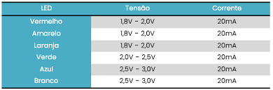

# Entendendo Resistores 

Esse repositório nada mais é do que um relato junto a uma explicação muito bacana.

Nessa última Sexta-Feira (26/02/2024) tive uma aula na Etec Professor Carmine Biagio Tundisi que estava ansioso para ter a bastante tempo, uma aula de S(istemas).E(mbarcados) falando sobre as diferenças de voltagens e correntes entre os resistores e ensinando como fazer o cálculo, foi uma aula muito bacana proporcionada pelos meus professores Kátia Maria e Robson Aparecido.

## Explicação

Antes de tudo é preciso entender a princípio como fazer o cálculo para então chegar nas cores como os resistores em si funcionam, vamos lá:

Primeiramente vamos trabalhar com leds, nosso objetivo será acender um led sem queimar, vamos usar a tabela abaixo como molde:
<div align="center">
  
</div>

Supondo que a gente pegue um led branco (que trabalha na tensão de 2,5v - 3v na corrente de 20mAh) e tente ligar ele com uma bateria com uma tensão de 9v e 20mAh. Se conectarmos diretamente, o led irá queimar sem nem esboçar reação, pois a voltagem é muitas vezes mais alta que o máximo aceito por ele, então precisamos de um resistor para fazer essa ponte, mas agora a questão é, como descobrir qual é o ideial?

Bom, agora existem 2 passos a serem seguidos:
- Calcular quantos ohms o resistor necessitará;
- Entender como funcionam as cores dos resistores.

### Cálculando OHMS

Bom a fórmula para o cálculo de ohms é um tanto simples, se resume a:
```text
   R = (Voltagem Alimentação - Voltagem Led) / (mAh/1000)
```
No nosso caso seria
```text
   R = (9 - 3) / (20/1000)
   R = 6 / 0,02
   R = 300ohms
```
Com isso sabemos que precisamos de um resistor de 300ohmns, mas agora qual é esse resistor?

### Entendendo os resistores
<div align="center">
  
</div>

Seguindo essa tabela, a lógica é bem simples basta:
1- Concatenar 1° e 2° faixa
2- Multiplicar pela 3° faixa

Ou seja se quisermos um resistor de 300ohmns

Precisariamos da seguinte sequência:
```text
  OHMS = (Laranja(3) + Preto(0)) x Marrom(10)
  OHMS = 30 x 10
  OHMS = 300
```
